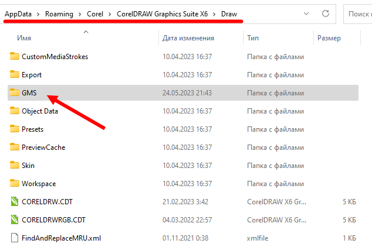
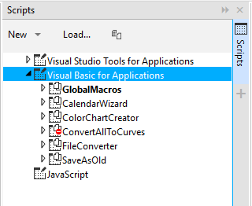
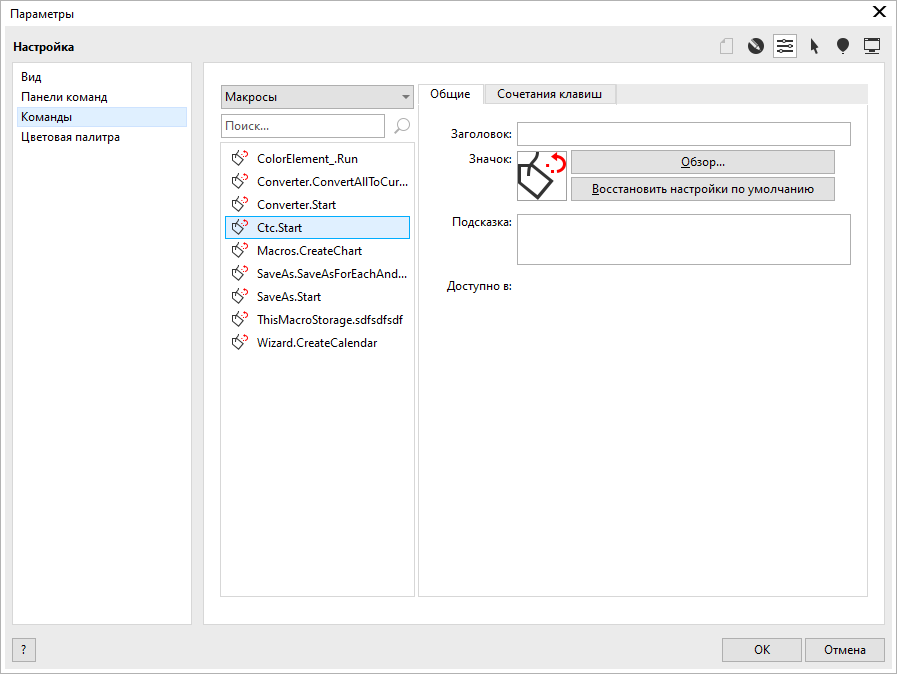
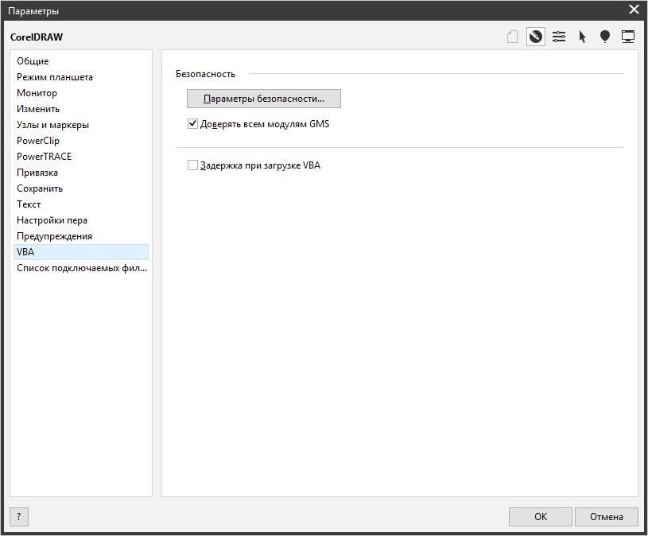

# Установка макросов

Здесь вы узнаете, как установить "обычный" макрос, то есть gms-файл. Аддоны в виде dll-библиотек, докеры и комплексный софт обычно имеют свои инсталляторы или собственные инструкции по установке.

## Стандартная установка

1. Скопируйте файл макроса в папку `%appdata%\Corel\[ваша версия корела]\Draw\GMS\`. Проще всего сделать этот пункт автоматически при помощи [батника](https://vk.com/wall-176793942_562). 

> Вручную это делается так. Чтобы найти эту папку, вставьте путь `%appdata%\Corel\` в адресную строку проводника, так вы попадёте в папку с настройками корела, дальше зайдите в папку с нужной версией корела, потом в `Draw`, потом в `GMS`. Сюда и скопируйте gms-файл макроса. Если корел запущен - перезапустите. Макрос установлен.

2. Дальше можно либо запускать макрос из диспетчера макросов (если макрос нужен редко), либо можно вывести кнопку запуска макроса на одну из панелей. Диспетчер макросов открывается сочетанием `Ctrl+Shift+F11`. Там вы найдёте макрос в разделе `Visual Basic for Applications` - название, как правило, соответствует названию файла. Внутри макроса вы увидите один или несколько модулей, а внутри одного из модулей будет стартовая функция (она может называться `Start` или как-то ещё, их также может быть несколько, если макрос выполняет несколько функций). Так можно запустить макрос.

3. Чтобы установить кнопку на панель, надо зайти в меню `Инструменты` - `Параметры` - вкладка `Настройки`, пункт `Команды`. Там в выпадающем списке выберите `Макросы`. Там вы увидите список всех стартовых функций всех установленных макросов вида `ИмяМакроса.СтартоваяФункция`. Дальше настройка аналогична настройки любой другой функции корела. Вы можете просто перетащить мышкой стартовую функцию из списка на панель, а так же установить значок и/или название кнопки. Можете также создать новую панель команд в пункте слева `Панели команд`.

4. Нелишне будет также зайти в `Инструменты` - `Параметры` - вкладка `CorelDraw`, пункт `VBA` и убрать там галочку `Задержка при загрузке VBA`.

## Если что-то пошло не так

См. [Если макрос не работает](vba-repair.md)