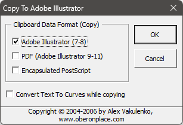

# AI Clipboard

Описание

- Имя файла: `AIClipBrd.gms`.
- Автор: **Alex Vakulenko**.
- Проверенно работает в версиях **16**, **25**.
- Язык: **English**.
- Распространяется **бесплатно**, код **открытый**.
- **Поддерживается сообществом**.

## Версии

- Доработанная версия для совместимости с 64 битными корелами от [Plixo](http://www.plixo.com.sg) - [ссылка](http://www.plixo.com.sg/software/AIClipBrd.gms) :earth_americas:, копия лежит в каталоге.

## Установка

[Стандартная](../../articles/installation.md).

## Использование

В макросе четыре функции с говорящими именами.Копируем в иллюстраторе, вставляем в корел через PasteAIFormat.

Работает через хитрый экспорт буфера обмена в файл и импорт файла на лист в кореле.