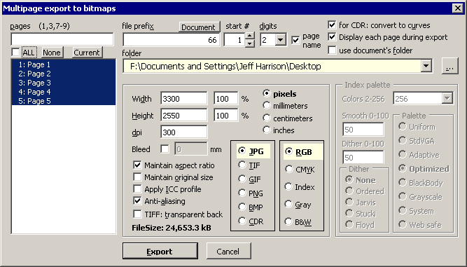

# ExportJPG

Экспорт документа постранично в растровые или векторные файлы.

- По имени файла известен как `wx_ExportJPG.gms`, `ExportJPG_X5-X9l.gms`.
- Авторы - **wOxxOm**, **Dastin**.
- Версия от Dastin проверенно работает в версиях **Х5–Х7 х32**, **Х6–Х9 х64**
- Языки: **English**.
- **Поддерживается сообществом** ?

## Версии

- Последняя известная версия - 2017-го года от *Dastin* - в корне. Скачано [отсюда](https://forum.trade-print.ru/showthread.php?t=43198), требуется регистрация.
- Оригинальную версию от *wOxxOm* можно *купить* на [Macromonster](https://macromonster.com/product/woxxom-multipage-export-to-bitmaps/), но она давно морально устарела и продаётся с постоянной стопроцентной скидкой, поэтому, думается, макрос можно считать общественным достоянием.

## Установка

[Стандартная](../../articles/installation.md).

## Использование