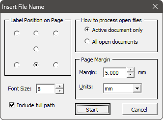

# File Name Inserter

Вставляет имя файла документа на страницу(ы).

- По имени файла известен как `PathLabel.gms`.
- Проверенно работает в версии **16**.
- Язык: **English**.
- Распространяется **бесплатно**, код **открытый**.
- **Без поддержки**.

## Установка

[Стандартная](../../articles/installation.md).

## Использование

