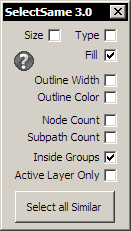

# Select Same

Позволяет находить объекты, похожие на выделенный, по разным признакам.

- По имени файла известен как `JH_SelectSame.gms`.
- Автор - **Jeff**.
- Заявлена совместимость с версиями  **15, 16, 17, 18, 19, 20, 21**.
- Язык: **English**.
- Распространяется **бесплатно**, код **закрытый**.
- Предположительно **поддерживается автором**.

## Скачать

- Версия 3 - [ссылка](http://macromonster.com/product/jeffs-select-same-2/) :earth_americas:
- Также копия последней версии [лежит в архиве](archive/jh_selectsame.zip)

## Установка

В архиве установщики для разных версий.

## Использование

