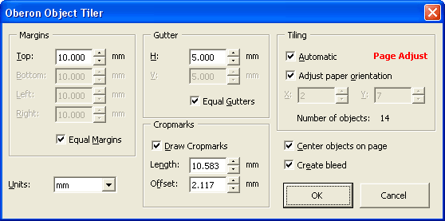
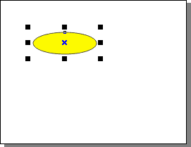
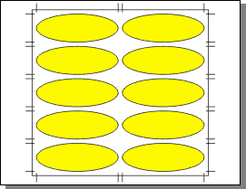

# Oberon Object Tiler

This is an updated version of the old [Object Tiler script](http://www.oberonplace.com/draw/drawscripts/tilersh.htm) which has been re-written in VBA and is now compatible with CorelDRAW 10, 11, 12, X3, X4 and Corel DESIGNER 10, 12. The VBA version of the program is **much** faster than the original.

The macro duplicates the selected object(s) horizontally and vertically to fit as many on the page as possible. You can specify the desired page margins and object spacing. You can also place crop marks on each row/column of the objects:

**Before**:

**After**:

The macro can automatically adjust page orientation if this allows to fit more shapes on the page. Of course, this can be disabled.

The downloadable archive file below contains the GMS module with the macro and two images for the toolbar button in case you want to add the macro to a toolbar:

